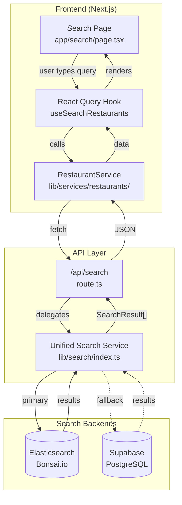
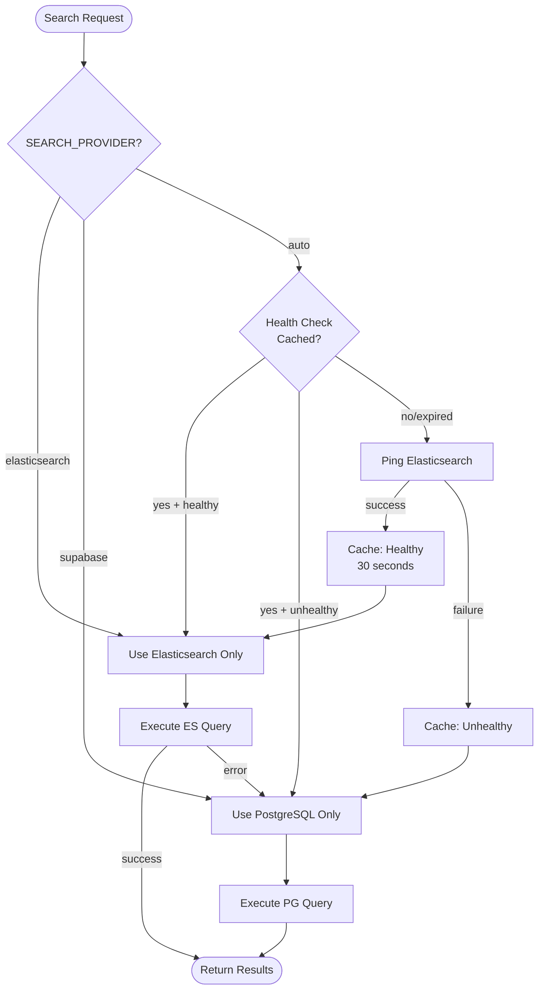
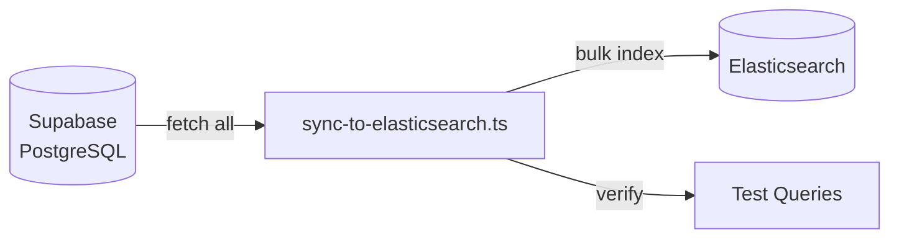

# Search Flow Diagram

## System Overview

```mermaid
flowchart TB
    subgraph Frontend["Frontend (Next.js)"]
        UI[Search Page<br/>app/search/page.tsx]
        Hook[React Query Hook<br/>useSearchRestaurants]
        Service[RestaurantService<br/>lib/services/restaurants/]
    end

    subgraph API["API Layer"]
        Route["/api/search"<br/>route.ts]
        Unified[Unified Search Service<br/>lib/search/index.ts]
    end

    subgraph Backends["Search Backends"]
        ES[(Elasticsearch<br/>Bonsai.io)]
        PG[(Supabase<br/>PostgreSQL)]
    end

    UI -->|"user types query"| Hook
    Hook -->|"calls"| Service
    Service -->|"fetch"| Route
    Route -->|"delegates"| Unified

    Unified -->|"primary"| ES
    Unified -.->|"fallback"| PG

    ES -->|"results"| Unified
    PG -.->|"results"| Unified
    Unified -->|"SearchResult[]"| Route
    Route -->|"JSON"| Service
    Service -->|"data"| Hook
    Hook -->|"renders"| UI
```

## Provider Selection Flow

```mermaid
flowchart TD
    Start([Search Request]) --> CheckEnv{SEARCH_PROVIDER?}

    CheckEnv -->|"elasticsearch"| UseES[Use Elasticsearch Only]
    CheckEnv -->|"supabase"| UsePG[Use PostgreSQL Only]
    CheckEnv -->|"auto"| CheckCache{Health Check<br/>Cached?}

    CheckCache -->|"yes + healthy"| UseES
    CheckCache -->|"yes + unhealthy"| UsePG
    CheckCache -->|"no/expired"| PingES[Ping Elasticsearch]

    PingES -->|"success"| CacheHealthy[Cache: Healthy<br/>30 seconds]
    PingES -->|"failure"| CacheUnhealthy[Cache: Unhealthy]

    CacheHealthy --> UseES
    CacheUnhealthy --> UsePG

    UseES --> TryES[Execute ES Query]
    TryES -->|"success"| Return([Return Results])
    TryES -->|"error"| UsePG

    UsePG --> TryPG[Execute PG Query]
    TryPG --> Return
```

## Data Sync Process

```mermaid
flowchart LR
    PG[(Supabase<br/>PostgreSQL)] -->|"fetch all"| Sync[sync-to-elasticsearch.ts]
    Sync -->|"bulk index"| ES[(Elasticsearch)]
    Sync -->|"verify"| Test[Test Queries]
```
